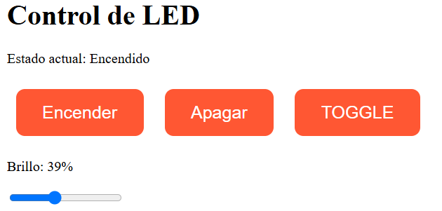

# 🔌 Control de LED vía WiFi con ESP8266

Este proyecto permite controlar un LED conectado a un **ESP8266** desde una interfaz web. Se puede encender, apagar, hacer toggle y ajustar su brillo usando un deslizador de rango PWM. El ESP actúa como punto de acceso WiFi al que te podés conectar directamente.

## 📷 Vista previa

Así se ve la interfaz web desde un navegador:



## 📦 Requisitos

- Placa ESP8266 (NodeMCU, Wemos D1 Mini, etc.)
- Arduino IDE con soporte para ESP8266
- Navegador web
- Dispositivo con WiFi

## 📡 Configuración de red

El ESP8266 se configura como punto de acceso (AP):

- **SSID:** `ESPap`
- **Password:** `thereisnospoon`

Podés modificar estos valores en el bloque:

```cpp
#define APSSID "ESPap"
#define APPSK "thereisnospoon"
```
